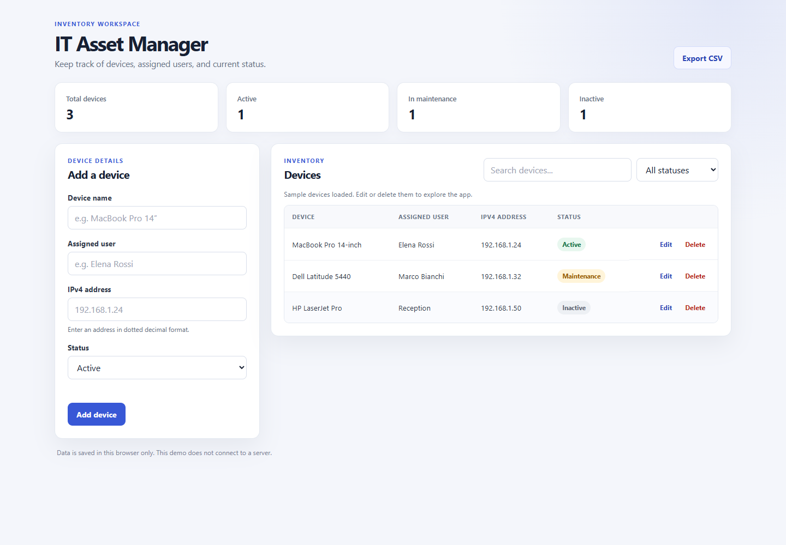

# IT Asset Manager

A browser-based inventory tool for recording IT devices, their assigned users, IP addresses, and status. Built with plain HTML, CSS, and JavaScript, with no build step or external dependencies.

## Features

- Add, edit, search, filter, and delete devices.
- Validate IPv4 addresses before saving a record.
- View totals by status and export the inventory as CSV.
- Keep records in browser `localStorage` between visits.
- Load sample devices to explore the interface without entering data first.
- Use the responsive layout on desktop and mobile screens.

## Run locally

1. Clone this repository or download the project files.
2. Open `index.html` in a modern browser.

No package installation or build command is required.

## Data storage

This is a frontend demo. Inventory data stays in the current browser and is not sent to a server or shared across devices. Clearing the browser's site data will remove saved records. Use **Export CSV** to keep a separate copy.

## Project files

- `index.html` contains the accessible page structure and form.
- `style.css` contains the responsive layout and visual styles.
- `script.js` contains validation, filtering, editing, storage, and CSV export.

## Built with

HTML · CSS · JavaScript · Browser `localStorage` API
